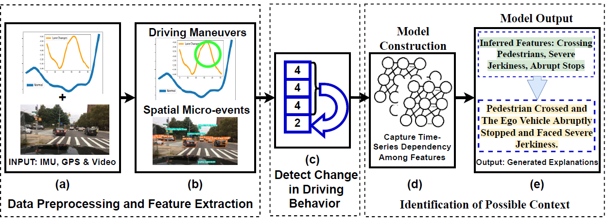

# <strong><em>DriCon: On-device Just-in-Time Context Characterization for Unexpected Driving Events</em></strong>
Driving is a complex task carried out under the influence of diverse spatial objects and their temporal interactions. Therefore, a sudden fluctuation in driving behavior can be due to either a lack of driving skill or the effect of various on-road spatial factors such as pedestrian movements, peer vehicles’ actions, etc. Therefore, understanding the context behind a degraded driving behavior just-in-time is necessary to ensure on-road safety. In this paper, we develop a system called DriCon that exploits the information acquired from a dashboard-mounted edge-device to understand the context in terms of micro-events from a diverse set of on-road spatial factors and in-vehicle driving maneuvers taken. DriCon uses the live in-house testbed and the largest publicly available driving dataset to generate human interpretable explanations against the unexpected driving events. Also it provides a better insight with an improved accuracy of 80% over 50 hours of driving data than the existing driving behavior characterization techniques.
Use the following commands in sequence to run the system.
<p align="center">
      
</p>

## In-house Dataset
We primarily utilize the IMU, the GPS, and the video data captured through the front camera (facing towards the front windscreen) as different modalities. A sample dataset is provided with the following modalities which is collected over three different cities in India. The cities are Kolkata, Kharagpur and Mandarmani. For each city, we have provided 20 minutes of data, cumulating upto 1 hour. Due to large file size, we have provided the dataset in the following link.

https://iitkgpacin-my.sharepoint.com/:f:/g/personal/debasree_das_iitkgp_ac_in/Eu0EdsMSGCZDjGk6wxLlkpYB1cFq-whVswJvusmlCR-4mw?e=cSbrv1

The GPS data is in the following format:
- LOCATION Latitude :;LOCATION Longitude :; YYYY-MO-DD HH-MI-SS_SSS;

The IMU data is in the following format:
- timestamp | G:y-axis,z-axis,x-axis


| Modalities    | Sampling Rate/fps | Duration (in seconds) |
|---------------|-------------------|-----------------------|
| Accelerometer | 15                | 60                    |
| GPS           | 1                 | 60                    |
| Video         | 30                | 60                    |

## Data Annotation Platform
- We have annotated our dataset using this platform developed by us: https://drivingskillsvalidator.web.app/


## Commands to run the model
- python data_collect.py <file_name> // Collect Data
- python maneuvers.py <file_name> // Feature Extraction 
- python script_vid.py <file_name> // Preprocessing
- python som_model.py // Running the model

## Dataset
A sample in-house dataset is provided in the dataset folder
# Reference
To refer the <em>DriCon</em> framework or the dataset, please cite the following work.

<!-- [Download the paper from here](https://dl.acm.org/doi/10.1145/3549548). -->

BibTex Reference:
```
@INPROCEEDINGS{dasdricon2023,
  author={Das, Debasree and Chakraborty, Sandip and Mitra, Bivas},
  booktitle={2023 IEEE International Conference on Pervasive Computing and Communications (PerCom)}, 
  title={DriCon: On-device Just-in-Time Context Characterization for Unexpected Driving Events}, 
  year={2023},
  volume={},
  number={},
  pages={},
  doi={}}

```
For questions and general feedback, contact Debasree Das (debasree1994@gmail.com).

